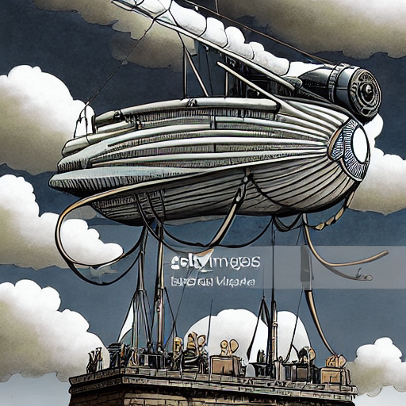
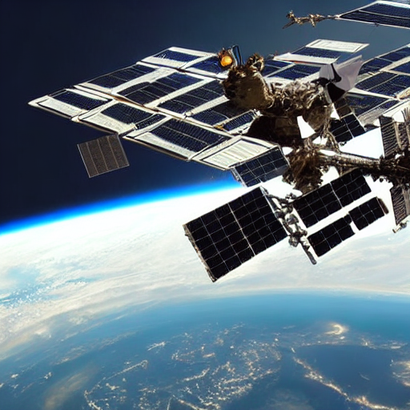

# 🎨 AI Image Generator

A Python project that generates beautiful images from text prompts using Stable Diffusion. This project provides multiple interfaces: a web interface, command-line interface, and a Python library.

## ✨ Features

- **Text-to-Image Generation**: Create images from natural language descriptions
- **🚀 GPU Acceleration**: Automatic GPU detection and optimization (CUDA, MPS, CPU)
- **Multiple Interfaces**: Web UI, CLI, and Python library
- **Customizable Parameters**: Control image quality, size, and generation settings
- **Reproducible Results**: Use seeds for consistent image generation
- **Multiple Models**: Support for various Stable Diffusion models
- **User-Friendly**: Beautiful web interface with example prompts
- **Performance Monitoring**: Real-time timing and memory usage display

## 🚀 Quick Start

### Installation

1. **Clone the repository:**
   ```bash
   git clone <repository-url>
   cd text-to-image-project
   ```

2. **Install dependencies:**
   ```bash
   # For GPU acceleration (recommended)
   pip install torch torchvision torchaudio --index-url https://download.pytorch.org/whl/cu118
   pip install -r requirements.txt
   
   # For CPU only
   pip install -r requirements.txt
   ```

3. **Verify installation and GPU support:**
   ```bash
   python cli_interface.py --gpu-info
   ```

### Usage

#### 🌐 Web Interface (Recommended)

Launch the beautiful web interface:

```bash
python web_interface.py
```

Then open your browser to `http://localhost:7860`

#### 💻 Command Line Interface

Generate images from the command line:

```bash
# Basic usage
python cli_interface.py "A beautiful sunset over mountains"

# With custom parameters
python cli_interface.py "A cute robot playing with a cat" \
    --steps 50 \
    --guidance 8.0 \
    --width 768 \
    --height 512 \
    --seed 42

# Save with custom filename
python cli_interface.py "Futuristic city" --output my_city
```

#### 📚 Python Library

Use the image generator in your own Python code:

```python
from image_generator import ImageGenerator

# Initialize generator
generator = ImageGenerator()

# Generate image
image, seed = generator.generate_image(
    prompt="A magical forest with glowing mushrooms",
    negative_prompt="blurry, low quality",
    num_inference_steps=30,
    guidance_scale=7.5,
    width=512,
    height=512
)

# Save image
generator.save_image(image, "magical_forest", "my_images")
```

## 🎛️ Parameters

### Generation Parameters

- **Prompt**: Text description of the image you want to generate
- **Negative Prompt**: What to avoid in the image (e.g., "blurry, low quality")
- **Steps**: Number of denoising steps (10-100, higher = better quality but slower)
- **Guidance Scale**: How closely to follow the prompt (1.0-20.0, higher = more adherence)
- **Width/Height**: Image dimensions (256-1024 pixels, must be multiples of 64)
- **Seed**: Random seed for reproducible results

### Available Models

- `runwayml/stable-diffusion-v1-5` (default)
- `stabilityai/stable-diffusion-2-1`
- `CompVis/stable-diffusion-v1-4`
- `prompthero/openjourney`
- `dreamlike-art/dreamlike-photoreal-2.0`
- `stabilityai/stable-diffusion-xl-base-1.0`

#### Model Comparison Example
Same prompt with different models:


*Stable Diffusion v1.5: "A magical forest with glowing mushrooms and fairy lights, fantasy art"*


*OpenJourney (Midjourney-style): "A magical forest with glowing mushrooms and fairy lights, fantasy art"*

List all available models:
```bash
python cli_interface.py --list-models
```

## 📁 Project Structure

```
text-to-image-project/
├── image_generator.py      # Core image generation library
├── web_interface.py        # Gradio web interface
├── cli_interface.py        # Command-line interface
├── requirements.txt        # Python dependencies
├── README.md              # This file
└── generated_images/      # Output directory (created automatically)
```

## 🔧 Configuration

### Hardware Requirements

- **CPU**: Works on any modern CPU (slower generation)
- **GPU**: 
  - **NVIDIA**: RTX 3060+ with CUDA support (much faster)
  - **Apple Silicon**: M1/M2/M3 with MPS support (good performance)
  - **AMD**: Limited support, falls back to CPU
- **RAM**: At least 8GB RAM, 16GB+ recommended
- **VRAM**: 4GB+ for GPU acceleration (8GB+ recommended)
- **Storage**: ~10GB free space for models

### Environment Variables

- `CUDA_VISIBLE_DEVICES`: Specify which GPU to use
- `HF_HOME`: Set Hugging Face cache directory

## 🖼️ Sample Images

Here are some examples of images generated with this project:

### 🎨 Artistic Styles

*"A magical forest with glowing mushrooms and fairy lights, fantasy art"*


*"A steampunk airship flying through clouds, detailed illustration"*

### 🌆 Urban & Sci-Fi

*"A futuristic city with flying cars and neon lights, cyberpunk style"*


*"A cute robot playing with a cat in a garden, watercolor style"*

### 🏔️ Nature & Landscapes

*"A beautiful sunset over mountains, digital art style"*

### 🐉 Style Variations

*"A majestic dragon, oil painting style"*


*"A majestic dragon, digital art style"*


*"A majestic dragon, anime style"*

### 🏠 Parameter Experimentation

*"A peaceful cottage in a meadow" (Guidance: 5.0)*


*"A peaceful cottage in a meadow" (Guidance: 12.0)*

---

## 🎨 Tips for Better Results

### Writing Effective Prompts

1. **Be Specific**: "A majestic dragon soaring over snow-capped mountains at sunset" vs "dragon"
2. **Include Style**: Add style keywords like "oil painting", "digital art", "photorealistic"
3. **Use Adjectives**: Descriptive words help guide the generation
4. **Reference Artists**: "in the style of Van Gogh", "artwork by Studio Ghibli"

### Example Prompts

- "A serene lake reflecting mountains at sunset, oil painting style"
- "A futuristic city with flying cars and neon lights, cyberpunk style"
- "A magical forest with glowing mushrooms and fairy lights, fantasy art"
- "A steampunk airship flying through clouds, detailed illustration"
- "A cute robot playing with a cat in a garden, watercolor style"

### Batch Generation Examples
The project can generate multiple images efficiently:


*"A cute robot playing with a cat in a garden, watercolor style"*


*"A steampunk airship flying through clouds, detailed illustration"*


*"A serene lake reflecting mountains at sunset, oil painting style"*


*"A space station orbiting Earth, sci-fi art"*

### Parameter Tuning

- **Higher Steps (50-100)**: Better quality, slower generation
- **Higher Guidance (8-12)**: More faithful to prompt, less creative
- **Lower Guidance (5-7)**: More creative, less faithful to prompt
- **Square Images (512x512)**: Faster generation, good for most use cases
- **Larger Images (768x768+)**: Better detail, slower generation

## 🐛 Troubleshooting

### Common Issues

1. **Out of Memory Error**
   - Reduce image size (try 512x512)
   - Use CPU instead of GPU
   - Close other applications

2. **Slow Generation**
   - Use GPU if available
   - Reduce number of steps
   - Use smaller image size

3. **Model Download Issues**
   - Check internet connection
   - Clear Hugging Face cache: `rm -rf ~/.cache/huggingface`

4. **CUDA Errors**
   - Update NVIDIA drivers
   - Install compatible PyTorch version
   - Use CPU mode: `export CUDA_VISIBLE_DEVICES=""`

### Getting Help

- Check the console output for error messages
- Ensure all dependencies are installed correctly
- Try with default parameters first
- Use the web interface for easier debugging

## 📄 License

This project uses the Stable Diffusion model which is subject to its own license. Please review the model licenses on Hugging Face Hub.

## 🤝 Contributing

Contributions are welcome! Please feel free to submit a Pull Request.

## 🙏 Acknowledgments

- [Stability AI](https://stability.ai/) for Stable Diffusion
- [Hugging Face](https://huggingface.co/) for the diffusers library
- [Gradio](https://gradio.app/) for the web interface framework

---

**Happy Image Generating! 🎨✨** 